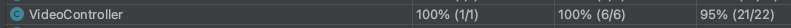
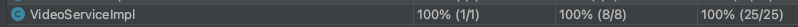
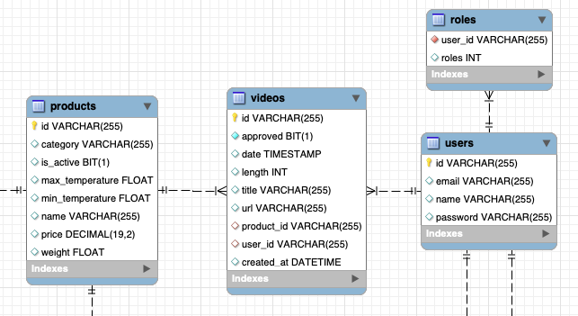
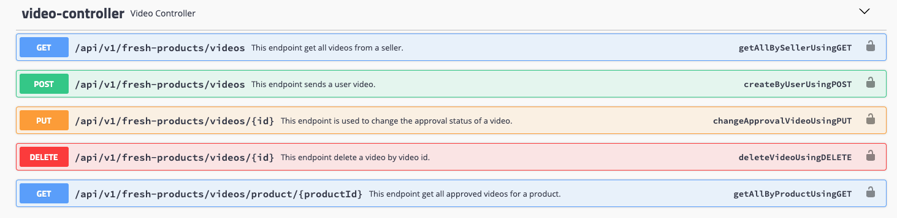
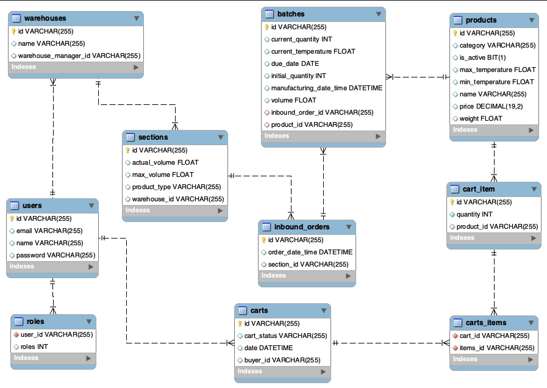

<div id="top"></div>
<!--
*** Thanks for checking out the Best-README-Template. If you have a suggestion
*** that would make this better, please fork the repo and create a pull request
*** or simply open an issue with the tag "enhancement".
*** Don't forget to give the project a star!
*** Thanks again! Now go create something AMAZING! :D
-->


<!-- PROJECT SHIELDS -->
<!--
*** I'm using markdown "reference style" links for readability.
*** Reference links are enclosed in brackets [ ] instead of parentheses ( ).
*** See the bottom of this document for the declaration of the reference variables
*** for contributors-url, forks-url, etc. This is an optional, concise syntax you may use.
*** https://www.markdownguide.org/basic-syntax/#reference-style-links
-->

<!-- PROJECT LOGO -->
<br />
<div align="center">
  <h2 align="center">Projeto Integrador Meli - Wave 5 - Grupo 5</h2>
</div> 

### Sobre o requisito 6
A elaboração deste requisito tem como objetivo criar uma nova funcionalidade que possibilite o envio de notificações via email, através de um outro microserviço, para novos compradores e vendedores no momento do cadastro de suas conta, e também quando realizarem compras em nosso marketplace. 

Palavras-chave: email, notificação, microserviços, API, usuário, compra, cadastro.

<!---
### Coverage


-->

## Atenção!
### Para executar esse requisito, é necessário clonar a API externa de emails que se encontra em:
- https://github.com/luizfelipers19/PomboCorreioAPI

### Links
* [Link do User Story](./doc/user-story.pdf)
* [Collections Postman](./doc/postman.json)


<!---
### Tabelas criadas


### Swagger

-->

### Controller principal
O controller principal desse requisito é `EmailController.java`, encontrado no projeto externo linkado anteriormente. Esse controller será acessado através de requisições partindo da nossa API principal (deste repositório em que estamos agora).

### Observações
- Para realizar a notificação via email para um cadastro de usuário, é necessário que ambas as API's estejam rodando (seja localmente, ou deployadas no ambiente de sua escolha).
- Confira se dentro da pasta /Connectors, a classe RestClient está com as informações corretas da API de notificação (endereços, portas e endpoints corretos).
- Os arquivos de testes unitários e de integração foram criados na API externa. Logo, essa API de marketplace não terão testes que levem em consideração o envio de emails.
- O projeto de notificação externa será aprimorado com o tempo, uma vez que no estado atual, não realiza verificações de segurança. Além de melhorias no código, será implementado o uso de um serviço

---

<!-- ABOUT THE PROJECT -->
### Sobre o projeto
O objetivo deste projeto final é implementar uma API REST no âmbito do slogan e aplicar os conteúdos trabalhados durante o BOOTCAMP MELI. (Git, Java, Spring, Banco de Dados, Qualidade e Segurança).

---
### Equipe Programming Gang
1. Gustavo Barretto
2. Jessica Kopps
3. Rodrigo Paczkovski
4. Vinícius Coelho
5. Mateus Silva
6. Caio Motta
7. Luiz Felipe Rosa

---
### Tecnologias e recursos utilizados

* [Java](https://www.java.com/pt-BR/)
* [Spring & SpringBoot & SpringWeb](https://spring.io/)
* [Swagger](https://swagger.io/)
* [Maven](https://maven.apache.org/)
* [Lombok](https://projectlombok.org/)
* [JUnit](https://junit.org)
* [Spring Test & Spring Boot Test](https://spring.io/)
* [Mockito](https://site.mockito.org)
* [JWT](https://jwt.io/)

---
<!-- GETTING STARTED -->
### Utilizando a aplicação
- Pré-requisito
  - É necessário a instalação e o JDK de no mínimo 11.    
<br> 

- Para a instalação do projeto, é necessário realizar um clone do seu repositório.


1. Clone o repo
   ```sh
   git clone https://github.com/mateusvictor/Projeto-Integrador-Meli.git
   git checkout requisito6/rodrigo
   ```
2. Instale Maven packages
   ```sh
   cd Projeto-Integrador-Meli
   mvn install
   ```
3. Crie o pacote target
   ```sh
   mvn package
   ```
4. Acesse a pasta target e execute o .jar
    ```sh
    cd target
    java -jar desafio-spring-0.0.1-SNAPSHOT.jar
    ```

---
### Banco de Dados

* [Database Schema - V2.0](./screenshots/db-schema-v2.png)
* Diagrama de entidade de relacionamento (DER)




<p align="right">(<a href="#top">voltar ao topo</a>)</p>
