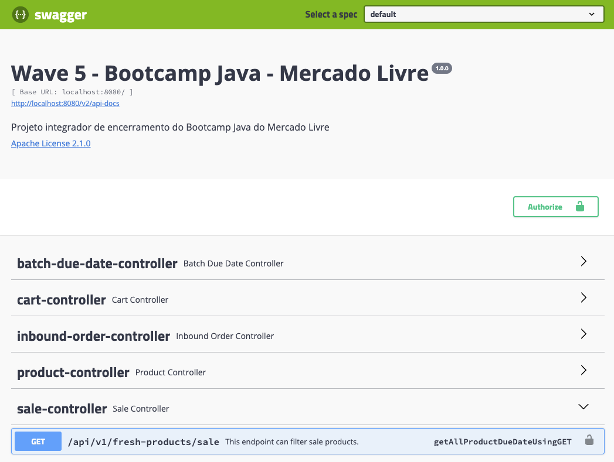
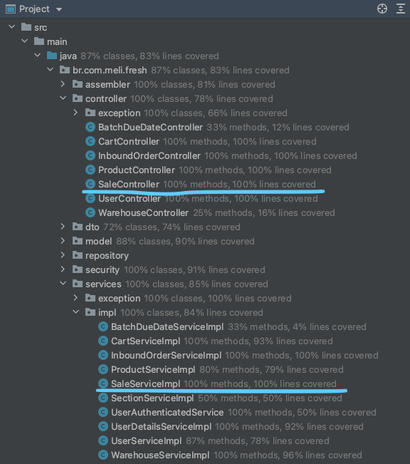

# Requisito 6 (Individual) - Jessica Kopps

---
### Objetivo do requisito

O objetivo deste requisito é filtrar os produtos que estão em promoção, que irão vencer três e uma semanas.

Feature que gostaria de ter implementado: adicionar esses produtos ao carrinho.

```json
{
  "productId": "String",
  "name": "String",
  "dueDate": "LocalDate",
  "price": "BigDecimal",
  "quantity": "int",
  "batchId": "String"
}
```

---
### Documentação

- [User story](./doc/Requisito6-UserStory-jkopps.docx)

- Swagger




---
### Banco de Dados

- Não foram realizada alterações no BD.

---
### Cobertura de testes



<p align="right">(<a href="#top">voltar ao topo</a>)</p>
