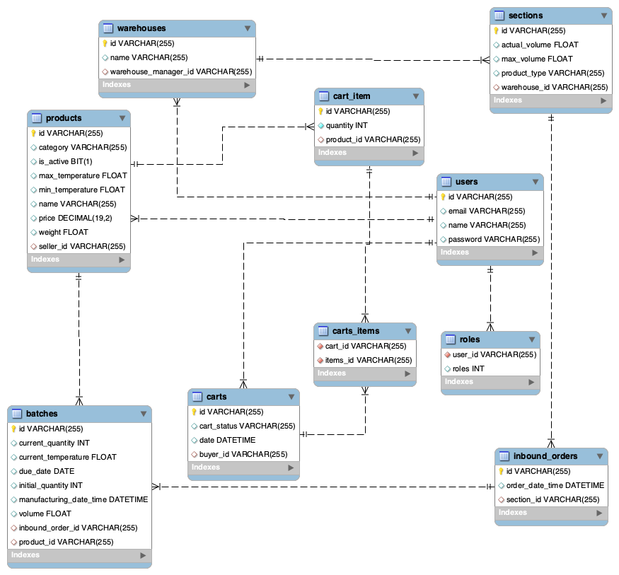

<div id="top"></div>
<!--
*** Thanks for checking out the Best-README-Template. If you have a suggestion
*** that would make this better, please fork the repo and create a pull request
*** or simply open an issue with the tag "enhancement".
*** Don't forget to give the project a star!
*** Thanks again! Now go create something AMAZING! :D
-->


<!-- PROJECT SHIELDS -->
<!--
*** I'm using markdown "reference style" links for readability.
*** Reference links are enclosed in brackets [ ] instead of parentheses ( ).
*** See the bottom of this document for the declaration of the reference variables
*** for contributors-url, forks-url, etc. This is an optional, concise syntax you may use.
*** https://www.markdownguide.org/basic-syntax/#reference-style-links
-->

<!-- PROJECT LOGO -->
<br />
<div align="center">
  <h2 align="center">Projeto Integrador Meli - Wave 5 - Grupo 5</h2>
</div> 

### Sobre o requisito 6
A elaboração deste requisito tem como objetivo criar uma nova funcionalidade que possibilite usuários logados a enviarem vídeos onde utilizam um produto fresco em suas receitas. A adição desses vídeos na página do produto, ajudará novos compradores a experienciar a compra de um produto fresco e com isso contribuir com na conversão de uma nova compra.
Palavra-chaves: vídeo, receita, produtos, conversão.

### User Story
[User Story](./screenshots/requisito-6-report.pdf)

### Tabelas criadas


### Swagger


### Controller principal
Controller principal desse requisito é `ReportController.java`

---

<!-- ABOUT THE PROJECT -->
### Sobre o projeto
O objetivo deste projeto final é implementar uma API REST no âmbito do slogan e aplicar os conteúdos trabalhados durante o BOOTCAMP MELI. (Git, Java, Spring, Banco de Dados, Qualidade e Segurança).

---
### Equipe Programming Gang
1. Gustavo Barretto
2. Jessica Kopps
3. Rodrigo Paczkovski
4. Vinícius Coelho
5. Mateus Silva
6. Caio Motta
7. Luiz Felipe Rosa

---
### Tecnologias e recursos utilizados

* [Java](https://www.java.com/pt-BR/)
* [Spring & SpringBoot & SpringWeb](https://spring.io/)
* [Swagger](https://swagger.io/)
* [Maven](https://maven.apache.org/)
* [Lombok](https://projectlombok.org/)
* [JUnit](https://junit.org)
* [Spring Test & Spring Boot Test](https://spring.io/)
* [Mockito](https://site.mockito.org)
* [JWT](https://jwt.io/)

---
<!-- GETTING STARTED -->
### Utilizando a aplicação
- Pré-requisito
    - É necessário a instalação e o JDK de no mínimo 11.    
      <br>

- Para a instalação do projeto, é necessário realizar um clone do seu repositório.

Clone o repositório
   ```sh
   git clone https://github.com/mateusvictor/Projeto-Integrador-Meli.git
   git checkout requisito6/gustavo
   ```
---
