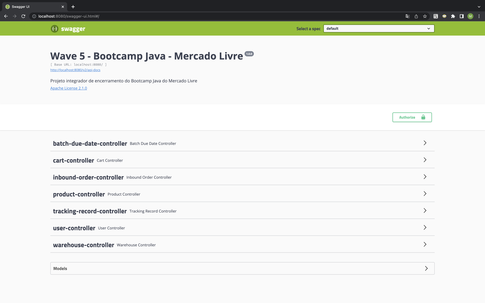
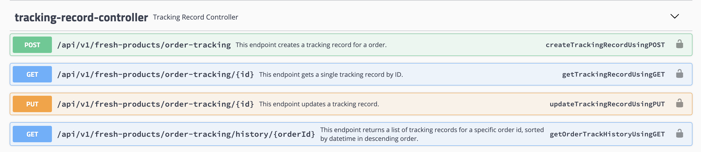
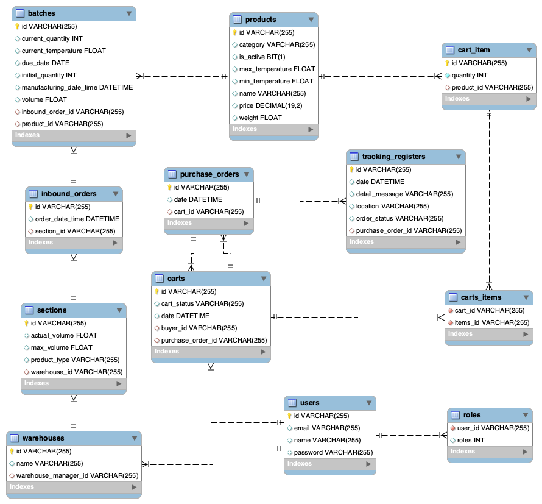
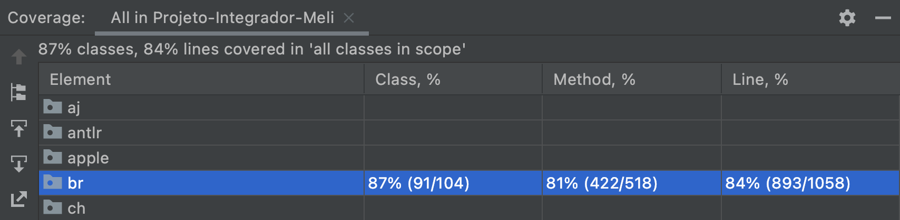

<!-- PROJECT LOGO -->
<br />
<div align="center">
  <h1 align="center">Projeto Integrador Meli - Wave 5 - Grupo 5</h1>
    <h3 align="center">Requisito 6 (Individual) - Mateus Victor Santos da Silva</h3>
</div>

---

### Sobre o requisito
Dentro do contexto do Projeto Integrador, o objetivo desse requisito é possibilitar o rastreamento em tempo real dos pedidos realizados por compradores.

Nesse sentido, após a realização do checkout do carrinho (isto é, o status do carrinho se torna fechado e a compra é efetuada), uma compra é criada e um registro de rastreamento inicial, com o status "PREPARING", é emitido.

Em seguida, os representantes responsáveis pelo pedido são capazes de criar novos registros de rastreio, até que a entrega seja finalizada. Um registro de rastreio contém as seguintes informações:

```json
{
  "location": "string",
  "detailMessage": "string",
  "orderStatus": "string",
  "orderId": "string"
}
```

Por fim, a lista de registros de rastreio de um pedido (ou seja, o histórico do pedido) pode ser consultada a partir do ID do pedido. Exemplo:
```json
[
    {
        "id": "3af07858-4ad6-41b2-9bff-263180245e0d",
        "date": "2022-05-04T17:24:10",
        "location": "TATUAPE - SAO PAULO",
        "detailMessage": "Seu pedido foi entregue.",
        "orderStatus": "FINISHED",
        "orderId": "2b9def80-eae3-4332-b2a3-16d26f434256"
    },
    {
        "id": "65bd2377-1b4f-45ce-b39a-acd4d715ba07",
        "date": "2022-05-04T17:23:47",
        "location": "TATUAPE - SAO PAULO",
        "detailMessage": "Seu pedido saiu para entrega.",
        "orderStatus": "ON_THE_WAY",
        "orderId": "2b9def80-eae3-4332-b2a3-16d26f434256"
    },
    {
        "id": "76a7cf80-2b4b-49b6-ad34-355b2009e8af",
        "date": "2022-05-04T17:23:01",
        "location": "TATUAPE / SP - WAREHOUSE",
        "detailMessage": "Um representante esta preparando o seu pedido.",
        "orderStatus": "PREPARING",
        "orderId": "2b9def80-eae3-4332-b2a3-16d26f434256"
    }
]
```
---

### PDF
* [Descrição do requisito](Requisito_6_Mateus_Victor.pdf)

### Coleção do Postman do requisito
* [Coleção do Postman - Req 6](req6.postman_collection.json)

* Observações
  - Para a realização dos testes, siga a ordem das requisições da coleção;
  - Crie um usuário, realize o login e insira o token de autenticação em cada requisição.

### Swagger

* Projeto completo: 


* Endpoints do requisito 6:

  

### Banco de Dados

* Novas entidades criadas: PurchaseOrder e TrackingRecord.

* Diagrama de entidade de relacionamento atualizado (DER)




### Cobertura de testes



<p align="right">(<a href="#top">voltar ao topo</a>)</p>
